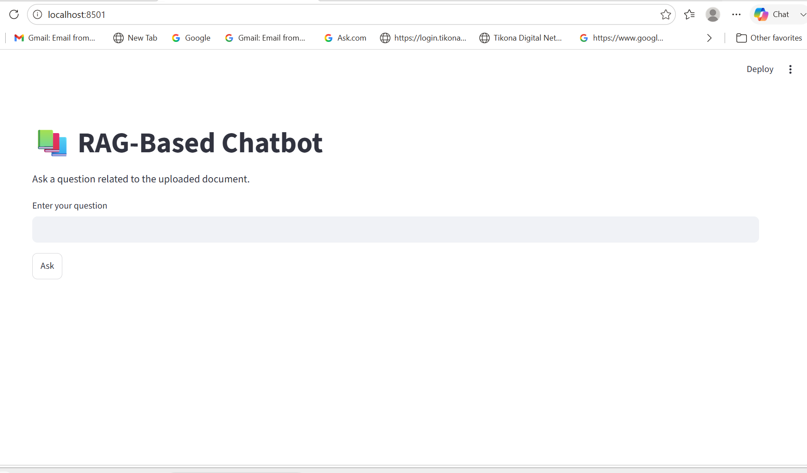
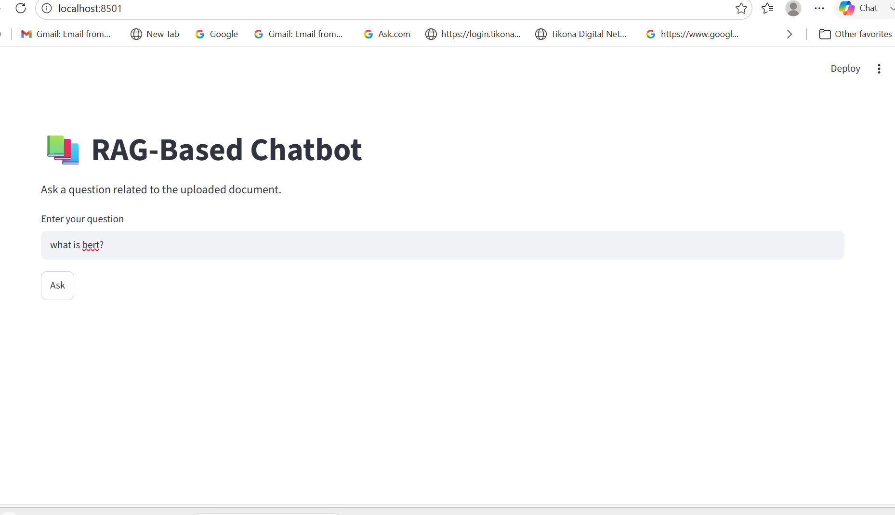
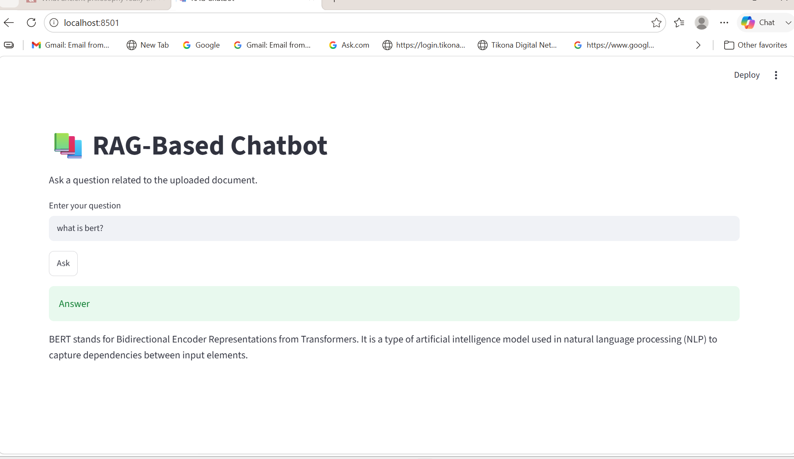

# 📚 Retrieval-Augmented Generation (RAG) Pipeline for PDF Question Answering

An end-to-end **Retrieval-Augmented Generation (RAG)** application that answers questions from PDF documents using **semantic search**, **vector embeddings**, and **Large Language Models (LLMs)**.

Instead of relying only on an LLM's pre-trained knowledge, the system retrieves the most relevant information from uploaded PDF documents and uses it as context to generate accurate, grounded responses.

The project integrates **Sentence Transformers**, **ChromaDB**, **LangChain**, **Groq Llama**, and **Streamlit** to build a complete document question-answering system.

---

# 🚀 Features

- 📄 Load and process PDF documents
- ✂️ Split documents into semantic chunks
- 🧠 Generate embeddings using Sentence Transformers
- 💾 Store embeddings in ChromaDB
- 📑 Retrieve Top-K relevant chunks
- 🤖 Generate context-aware answers using Groq Llama-3.1
- 🌐 Interactive Streamlit interface
- ⚡ Persistent vector database
- 🏗️ Modular RAG architecture

---

# 🏗️ System Architecture

```text
                    PDF Documents
                          │
                          ▼
                PDF Loader (PyMuPDF)
                          │
                          ▼
                  Text Extraction
                          │
                          ▼
                   Text Chunking
                          │
                          ▼
     SentenceTransformer (all-MiniLM-L6-v2)
                          │
                          ▼
              Dense Vector Embeddings
                          │
                          ▼
               ChromaDB Vector Database
                          ▲
                          │
                   User Question
                          │
                          ▼
             Query Embedding Generation
                          │
                          ▼
            Semantic Similarity Search
                          │
                          ▼
               Top-K Relevant Chunks
                          │
                          ▼
               Prompt Construction
                          │
                          ▼
             Groq Llama-3.1-8B-Instant
                          │
                          ▼
                Context-Aware Answer
```

---

# 🛠️ Tech Stack

| Category | Technology |
|----------|------------|
| Language | Python |
| Framework | LangChain |
| UI | Streamlit |
| Embedding Model | Sentence Transformers (all-MiniLM-L6-v2) |
| Vector Database | ChromaDB |
| LLM | Groq (Llama-3.1-8B-Instant) |
| PDF Processing | PyMuPDF |
| Numerical Computing | NumPy |
| Environment Variables | python-dotenv |

---

---

# ⚙️ Installation

## 1. Clone the Repository

```bash
git clone https://github.com/Navya-nigam/RAG-Based-Chatbot.git

cd RAG-Based-Chatbot
```

## 2. Create a Virtual Environment

### Windows

```bash
python -m venv .venv
.venv\Scripts\activate
```

### Linux / macOS

```bash
python3 -m venv .venv
source .venv/bin/activate
```

## 3. Install Dependencies

```bash
pip install -r requirements.txt
```

## 4. Configure Environment Variables

Create a `.env` file:

```env
GROQ_API_KEY=your_groq_api_key_here
```

## 5. Build the Vector Database

Open:

```text
notebook/document.ipynb
```

Run all notebook cells to:

- Load PDF documents
- Extract text
- Create chunks
- Generate embeddings
- Store embeddings in ChromaDB

## 6. Launch the Application

```bash
streamlit run app.py
```

Open the generated local URL in your browser and start asking questions about your documents.
---

# 🔄 RAG Pipeline Workflow

The RAG pipeline retrieves relevant information from PDF documents before generating a response with an LLM.

## Step 1 — Load PDF Documents

PDFs are loaded using **PyMuPDF**, which extracts text while preserving document structure.

**Output**

- Document text
- Page information
- Metadata

---

## Step 2 — Text Chunking

The extracted text is divided into smaller chunks because LLMs cannot process an entire document at once.

Chunking improves:

- Retrieval accuracy
- Search efficiency
- Context utilization

---

## Step 3 — Generate Embeddings

Each chunk is converted into a **384-dimensional dense vector** using the Sentence Transformer model:

```text
all-MiniLM-L6-v2
```

Instead of storing plain text, the vector representation captures the semantic meaning of the content.

---

## Step 4 — Store Embeddings

Each chunk is stored in **ChromaDB** along with its:

- Embedding
- Document text
- Metadata
  - Source
  - Page number
  - Document title
  - Chunk index

The database is persistent, so embeddings only need to be generated once.

---

## Step 5 — User Query

When the user submits a question through the Streamlit interface, the query is converted into an embedding using the **same embedding model**.

Using the same model ensures that document chunks and user queries exist in the same vector space for meaningful similarity comparisons.

---

## Step 6 — Semantic Retrieval

The query embedding is compared with all stored document embeddings inside ChromaDB.

The vector database retrieves the **Top-K most relevant chunks** based on semantic similarity.

Example:

**Question**

```text
Explain HLER Architecture
```

**Retrieved Chunk**

```text
HLER decomposes the empirical research workflow into eight specialised agent roles coordinated by an Orchestrator...
```

---

## Step 7 — Prompt Construction

The retrieved chunks are combined with the user's question to form the prompt.

```text
Context:
<Document Chunk 1>

<Document Chunk 2>

Question:
Explain HLER Architecture.
```

Providing retrieved context helps reduce hallucinations and produces document-grounded answers.

---

## Step 8 — Response Generation

The prompt is sent to **Groq Llama-3.1-8B-Instant**, which generates the final answer using both:

- Retrieved document context
- User question

The generated response is displayed through the Streamlit interface.

---

# 🔍 Retrieval Process

```text
User Question
      │
      ▼
Generate Query Embedding
      │
      ▼
Semantic Similarity Search
      │
      ▼
Retrieve Top-K Chunks
      │
      ▼
Construct Prompt
      │
      ▼
Generate Answer
```

Only the retrieved chunks are provided to the LLM, ensuring responses remain grounded in the uploaded documents.

---

# 💡 Why Retrieval-Augmented Generation?

Unlike a standalone LLM, RAG retrieves relevant information before generating a response.

Advantages:

- ✅ Reduces hallucinations
- ✅ Improves factual accuracy
- ✅ Answers questions from documents provided
- ✅ Provides domain-specific responses
- ✅ Enables document-based question answering
---

# 🌐 Streamlit Interface

The project includes a **Streamlit** web application that provides an interactive interface for querying uploaded PDF documents.

The application allows users to:

- Ask questions in natural language
- Retrieve the most relevant document chunks
- Generate context-aware answers using Groq LLM
- View responses instantly through a simple web interface

Run the application using:

```bash
streamlit run app.py
```

---
# 📸 Demo

| Home | User Query | Generated Answer |
|------|------------|------------------|
|  |  |  |

Example:

```text
screenshots/
├── home.png
├── query.png
└── answer.png
```

---

# 💬 Example Queries

```
What is self-attention?

What is HLER Architecture?
```

---

# 💡 Sample Output

**Question**

```text
What is HLER Architecture?
```

**Answer**

```text
The HLER architecture decomposes the empirical research workflow into eight specialised agent roles coordinated by an Orchestrator that maintains a persistent RunState for managing datasets, variables, candidate questions, model specifications, and generated artefacts.
```

---

# ⚡ Challenges Faced

During development, several practical challenges were encountered:

- Understanding embedding generation using Sentence Transformers
- Selecting an appropriate chunk size
- Managing persistent storage in ChromaDB
- Debugging semantic retrieval and similarity scores
- Building effective prompts for the LLM
- Integrating the complete pipeline with Streamlit

---

# 🎯 Learning Outcomes

This project demonstrates practical implementation of:

- Retrieval-Augmented Generation (RAG)
- Semantic Search
- Dense Vector Embeddings
- ChromaDB Vector Database
- Sentence Transformers
- LangChain
- Prompt Engineering
- Large Language Models (LLMs)
- Streamlit
- Document Question Answering
- Information Retrieval

---

# 🚀 Future Improvements

Possible enhancements include:

- 📂 Multiple PDF support
- 📑 Source citations with page numbers
- 💬 Conversational memory
- 🐳 Docker containerization
- ☁ Cloud deployment (AWS / Azure / GCP)
- 📊 Analytics dashboard
- ⚡ Faster indexing for large document collections


---

# 📊 Performance Notes

The chatbot retrieves the **Top-K semantically similar document chunks** from ChromaDB before generating a response.

Response quality depends on:

- Chunk size
- Embedding model
- Retrieval accuracy
- Prompt design
- Selected LLM

Using retrieved context improves factual accuracy and reduces hallucinations.

---

# 📌 Current Limitations

- Supports only PDF documents
- No conversational memory
- No source citations
- No reranking model
- Local deployment only

---

# 🚀 Future Improvements

- 📂 Multiple PDF support
- 📑 Source citations
- 💬 Conversational memory
- 🔀 Hybrid Search
- 🚀 Cross-Encoder Reranking
- 🐳 Docker support
- ☁ Cloud deployment
- 📊 Analytics dashboard

---

# 🤝 Contributing

Contributions are welcome!

1. Fork the repository
2. Create a feature branch
3. Commit your changes
4. Open a Pull Request


---
# 📚 References

Built using:

- LangChain
- ChromaDB
- Sentence Transformers
- Groq API
- Streamlit
- PyMuPDF

---

# 👩‍💻 Author

*Navya Nigam*

B.Tech Computer Science (2022–2026)

Interested in Machine Learning, NLP, Large Language Models (LLMs), Retrieval-Augmented Generation (RAG), and AI Engineering.

GitHub: https://github.com/Navya-nigam

⭐ If you found this project useful, consider giving it a star!


